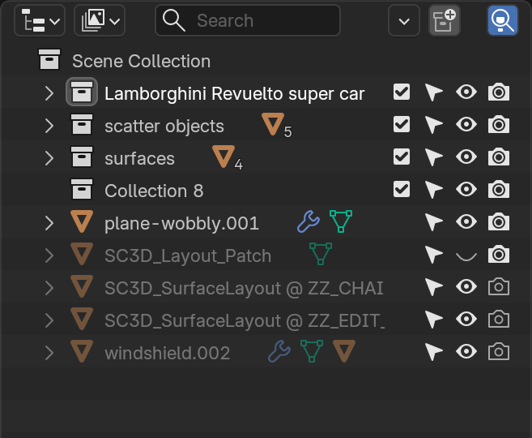
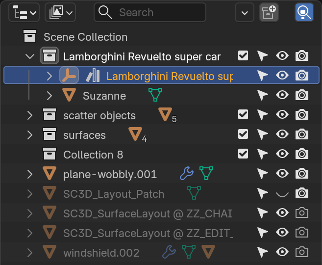

# Outliner Auto-Highlight

Keeps the active object in view in Blender's Outliner. You select something —
in the viewport, the Outliner, wherever — and the Outliner scrolls to it, opens
the collections it sits in, and can close everything else so the tree stays
readable.

Built for the moment you look at a big scene, see forty collections, and have no
idea where the object you just selected actually lives.

**Blender 4.2 or newer.** Works in 5.x, including 5.2 LTS.

| Before | After |
| --- | --- |
|  |  |

## What it does

- **Follows the active object.** Change the selection and the Outliner reveals
  it: parents expanded, row scrolled into view and highlighted.
- **Collapse Others** (optional) — everything that has nothing to do with the
  selection is closed, so a deep tree stays legible.
- **Reveal on demand.** A button for when you want it now rather than on the
  next selection change.
- Works with several Outliner editors open at once.

## Install

**Blender 4.2+ (recommended)** — take the extension zip from the
[latest release](https://github.com/sc3dstudio/auto-highlight/releases) and
either drag it onto the Blender window, or use *Edit ▸ Preferences ▸ Get
Extensions ▸ Install from Disk*.

**Classic add-on** — take the `-legacy.zip` from the same release and use *Edit ▸
Preferences ▸ Add-ons ▸ Install from Disk*. Use this one if you keep add-ons in
`scripts/addons` by hand or you are on Blender older than 4.2.

## Using it

Everything lives in the Outliner.

| Where | What |
| --- | --- |
| Outliner ▸ Filters | **Auto-Highlight** — the main switch |
| Outliner ▸ Filters | **Collapse Others** — greys out until Auto-Highlight is on |
| Outliner ▸ Filters | **Reveal Active Object Now** |
| Outliner header | the main switch as a small icon, at the right end |
| Outliner | `F3` → *Reveal Active Object Now* — bind it to a key if you use it often |

The switch is stored per file, not per editor: two Outliners in one file always
agree, and a scene you saved with it on comes back with it on.

## Settings

*Edit ▸ Preferences ▸ Add-ons ▸ Outliner Auto-Highlight* — check interval, the
header button, the defaults for newly created files, and a button to switch the
whole file on at once.

## Good to know

**Blender already does part of this.** `SpaceOutliner.scroll_to_active` —
"Scroll the active item into view when it changes outside of the Outliner" — is
built in, and it also expands the parent collections on its way. If that is all
you need, switch it on in *Outliner ▸ Filters* and you do not need this add-on.
What it does not do is close anything, which is the part this one adds.

**Closing the other collections is a real state change.** With Collapse Others
on, your tree is re-arranged every time the active object changes. That is the
point of the feature, but it also means a tree you expanded by hand closes again
next time you select something. Leave the option off if you would rather keep
your own arrangement.

**Clicking inside the Outliner counts too.** The add-on notices a new active
object, not where the click came from, so a click in the Outliner re-arranges
the tree the same way. The object you clicked is revealed, so the result makes
sense — it just is not distinguishable from a viewport selection.

**Verified on 5.2.1 only.** The extension requires 4.2+, and nothing in the API
used is newer than that, but no older Blender has actually been run. Details and
the full record: [docs/technical-notes.md](docs/technical-notes.md).

## Development

```
python tools/build_release.py          # builds both zips into dist/
python tools/build_release.py --check  # fails if the zips are older than the sources
```

The build prints the exact `blender --command extension validate` line for what
it just produced. Run it — and then actually install the zip, because `validate`
is not the whole story: it does not enforce the license rule that older Blender
versions apply at install time.

`tools/rollout_addon.py` reloads a running Blender session onto the current
source, `scripts/` holds the checks behind every claim above. The technical
notes explain how it works, what was measured, and what is still missing.

## License

GPL-3.0-or-later — see [LICENSE](LICENSE). An add-on that imports `bpy` is
generally treated as GPL-derived, so a more permissive license would be the
wrong claim to make rather than a generous one.

3.0 rather than the 2.0 that matches Blender's own source, because older Blender
versions refuse to install an extension that is not GPL-3.0-or-later. Blender
5.2 accepts 2.0, so the rejecting version cannot be reproduced on this machine;
3.0-or-later is the one value that installs everywhere.
